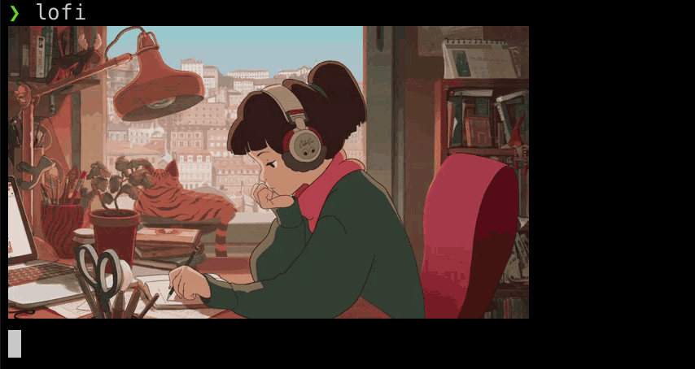

# Lofi Girl Terminal

## What's all this then?
You're a nerd 🤓 that lives on the command line 🧑‍💻 but you want some lofi beats 🎶 as you work? This might be for you.

Simpy a script that uses mpv to play the official Lofi Girl Youtube stream in the background alongside an image. In reality it isn't just for Lofi Girl. You could easily modify it to display any image with any stream.

## Requirements

- a mac
- mpv player

      brew install mpv
- iTerm2 terminal (required for image rendering)

      brew install --cask iterm2
- imgcat (image rendering script for iTerm2)

      sudo curl -o /usr/local/bin/imgcat -O https://iterm2.com/utilities/imgcat && sudo chmod +x /usr/local/bin/imgcat
- [lofi.sh](./lofi.sh)

      sudo curl -o /usr/local/bin/lofi -O https://raw.githubusercontent.com/oregonpillow/lofi-girl-terminal/master/lofi.sh && sudo chmod +x /usr/local/bin/lofi

## References
- mpv: https://github.com/mpv-player/mpv
- iTerm2: https://iterm2.com/
- imgcat: https://iterm2.com/documentation-images.html
- Lofi Girl Youtube Channel: https://www.youtube.com/c/lofigirl
